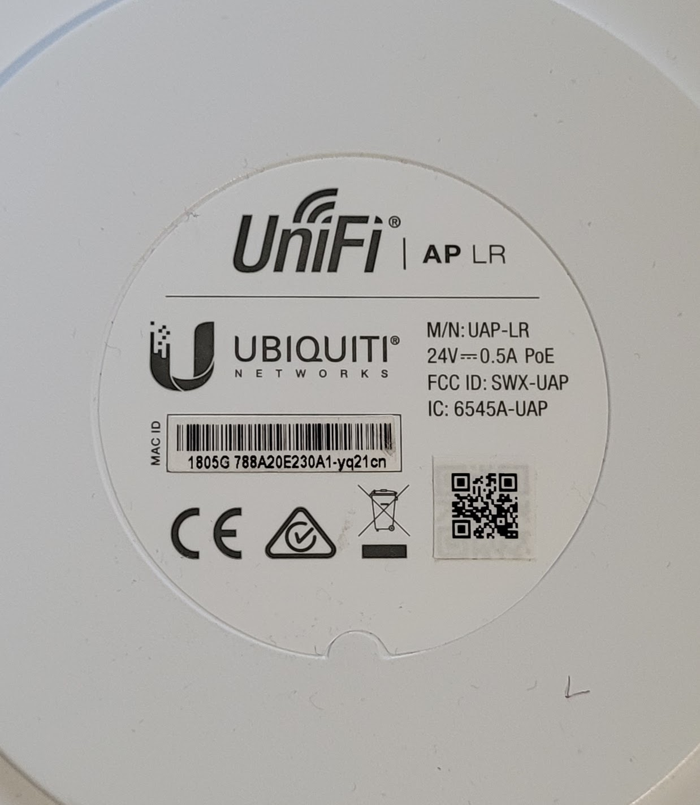

# Anleitung zum Flashen eines UNIF AP LR V1 mit Freifunk Nordhessen Firmware

<https://openwrt.org/toh/ubiquiti/unifi_ap>

Leider ist v2 nicht supported, es gibt zwar einen Ansatz diesen zu flashen, aber kein Firmwareimage von OpenWrt
Details zu den Ansätzen in den beiden verlinkten Forenthreads

## Wie erkenne ich einen V2 Router?

Leider ist die Version 2 nicht als Zusatz auf dem Produktlabel.
Man kann es aber wie folgt erkennen auf dem zurückgesetzten Router:

per SSH als User ubnt mit PWD ubnt auf dem Router anmelden:

`mca-dump | grep "model"`

Da sollte in ungefähr dann dies in der Ausgabe stehen:

"model": "U2Lv2",
"model_display": "UAP-LRv2"

Oder über den Unifi Controller, da meldet er sich als UAP-LR-v2

Und evtl. auch am Produktlabel. Dort ist der Typ mit M/N: UAP-LR angegeben.
Router, die ich als V2 indentifiziert habe, sehen wie folgt aus: 
